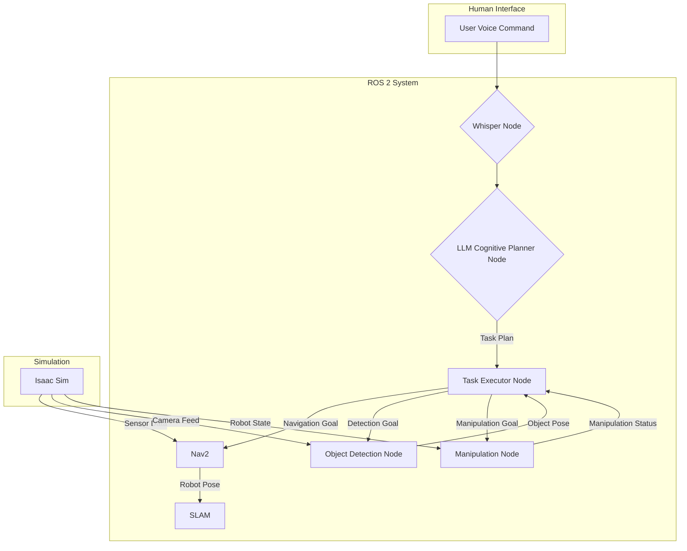

# Full Task Execution in Simulation

## Objective

This final section of the capstone project integrates all the individual components developed in the previous sections into a single, cohesive system. The goal is to achieve a full end-to-end execution of a complex task given by a natural language voice command. This involves orchestrating voice recognition, language understanding, task planning, navigation, perception, and manipulation.

## Final System Architecture

The final architecture is a ROS 2-based system where each component runs as a node, communicating through topics, services, and actions.



## The Main Execution Logic

The core of the full task execution is a central executive script, `task_executor.py`, which manages the state of the robot and sequences the actions based on the plan from the LLM.

### `task_executor.py`

```python
import rclpy
from rclpy.node import Node
from std_msgs.msg import String
from action_msgs.srv import CancelGoal
from nav2_msgs.action import NavigateToPose
from vision_msgs.msg import Detection3DArray
from manipulation_msgs.action import GraspObject

class TaskExecutor(Node):
    def __init__(self):
        super().__init__('task_executor')
        self.plan_subscriber = self.create_subscription(
            String,
            '/llm/plan',
            self.plan_callback,
            10)
        self.nav_client = rclpy.action.ActionClient(self, NavigateToPose, 'navigate_to_pose')
        self.manipulation_client = rclpy.action.ActionClient(self, GraspObject, 'grasp_object')
        self.detection_subscriber = self.create_subscription(
            Detection3DArray,
            '/perception/detections',
            self.detection_callback,
            10)
        self.current_plan = []
        self.get_logger().info('Task Executor node has been started.')

    def plan_callback(self, msg):
        self.get_logger().info(f'Received plan: {msg.data}')
        # Simple plan parsing, a real implementation would be more robust
        self.current_plan = msg.data.split(';')
        self.execute_next_step()

    def execute_next_step(self):
        if not self.current_plan:
            self.get_logger().info('Plan finished.')
            return

        step = self.current_plan.pop(0).strip()
        self.get_logger().info(f'Executing step: {step}')

        if step.startswith('navigate'):
            # Parse target from plan, e.g., "navigate to table"
            target_pose = self.get_pose_from_target(step.split(' to ')[1])
            self.send_nav_goal(target_pose)
        elif step.startswith('find'):
            # e.g., "find the red cup"
            self.target_object = step.split(' the ')[1]
            # Assumes perception is running and will publish detections
        elif step.startswith('pick_up'):
            # Assumes object was found
            self.send_manipulation_goal(self.last_detected_object)

    def send_nav_goal(self, pose):
        goal_msg = NavigateToPose.Goal()
        goal_msg.pose.pose = pose
        self.nav_client.wait_for_server()
        self._send_goal_future = self.nav_client.send_goal_async(goal_msg)
        self._send_goal_future.add_done_callback(self.nav_goal_response_callback)

    def nav_goal_response_callback(self, future):
        goal_handle = future.result()
        if not goal_handle.accepted:
            self.get_logger().info('Nav goal rejected')
            return
        self._get_result_future = goal_handle.get_result_async()
        self._get_result_future.add_done_callback(self.nav_get_result_callback)

    def nav_get_result_callback(self, future):
        result = future.result().result
        self.get_logger().info(f'Nav result: {result.success}')
        self.execute_next_step()

    # ... similar methods for manipulation and detection ...

def main(args=None):
    rclpy.init(args=args)
    executor = TaskExecutor()
    rclpy.spin(executor)
    executor.destroy_node()
    rclpy.shutdown()

if __name__ == '__main__':
    main()
```

### Integrated Code Blocks

Here are some examples of the other nodes that make up the full system.

#### Cognitive Planner Node (`cognitive_planner_node.py`)

This node interfaces with a large language model to turn a user command into a sequence of robot actions.

```python
import rclpy
from rclpy.node import Node
from std_msgs.msg import String
import openai  # Or any other LLM client

class CognitivePlanner(Node):
    def __init__(self):
        super().__init__('cognitive_planner')
        self.command_subscriber = self.create_subscription(
            String,
            '/user/command',
            self.command_callback,
            10)
        self.plan_publisher = self.create_publisher(String, '/llm/plan', 10)
        # Configure your LLM API key
        # openai.api_key = 'YOUR_API_KEY'

    def command_callback(self, msg):
        prompt = f"Convert the following command into a semi-colon separated plan for a robot. The available actions are navigate, find, and pick_up. Command: '{msg.data}'"
        
        try:
            # This is a mocked response. In a real scenario, you would call the LLM API.
            # response = openai.Completion.create(engine="text-davinci-003", prompt=prompt, max_tokens=100)
            # plan = response.choices[0].text.strip()
            
            mock_plan = "navigate to table; find red can; pick_up red can; navigate to user"
            self.get_logger().info(f"Generated plan: {mock_plan}")
            
            plan_msg = String()
            plan_msg.data = mock_plan
            self.plan_publisher.publish(plan_msg)

        except Exception as e:
            self.get_logger().error(f"Error generating plan: {e}")

def main(args=None):
    rclpy.init(args=args)
    planner = CognitivePlanner()
    rclpy.spin(planner)
    planner.destroy_node()
    rclpy.shutdown()

if __name__ == '__main__':
    main()
```

#### Manipulation Action Server (`manipulation_server.py`)

This node provides an action server for the robot's manipulator, allowing it to pick up objects.

```python
import rclpy
from rclpy.action import ActionServer
from rclpy.node import Node
from manipulation_msgs.action import GraspObject
import time

class ManipulationServer(Node):
    def __init__(self):
        super().__init__('manipulation_server')
        self._action_server = ActionServer(
            self,
            GraspObject,
            'grasp_object',
            self.execute_callback)

    def execute_callback(self, goal_handle):
        self.get_logger().info('Executing grasp...')
        
        # In a real robot, this would involve complex motion planning and gripper control.
        # Here, we simulate the action.
        time.sleep(5) # Simulate time to grasp
        
        goal_handle.succeed()
        
        result = GraspObject.Result()
        result.success = True
        return result

def main(args=None):
    rclpy.init(args=args)
    manipulation_server = ManipulationServer()
    rclpy.spin(manipulation_server)

if __name__ == '__main__':
    main()
```

## Running the Full Simulation

To run the complete capstone project, you need to launch all the components in the correct order.

### Launch File: `capstone.launch.py`

```python
from launch import LaunchDescription
from launch_ros.actions import Node

def generate_launch_description():
    return LaunchDescription([
        Node(
            package='isaac_ros_sim',
            executable='simulation_engine',
            name='isaac_sim'
        ),
        Node(
            package='slam_toolbox',
            executable='async_slam_toolbox_node',
            name='slam_toolbox',
            parameters=[{'use_sim_time': True}]
        ),
        Node(
            package='nav2_bringup',
            executable='bringup_launch',
            name='nav2_bringup'
        ),
        Node(
            package='whisper_ros',
            executable='whisper_node',
            name='whisper'
        ),
        Node(
            package='llm_ros',
            executable='cognitive_planner_node',
            name='cognitive_planner'
        ),
        Node(
            package='object_detection_ros',
            executable='detection_node',
            name='object_detector'
        ),
        Node(
            package='manipulation_ros',
            executable='manipulation_server',
            name='manipulation_server'
        ),
        Node(
            package='capstone_pkg',
            executable='task_executor.py',
            name='task_executor'
        ),
    ])
```

### Steps to Run

1.  **Source your ROS 2 workspace:**
    ```bash
    source install/setup.bash
    ```
2.  **Launch the simulation:**
    ```bash
    ros2 launch capstone_pkg capstone.launch.py
    ```
3.  **Provide a voice command:**
    "Okay robot, please find the red soda can on the table and bring it to me."

## Example Task Walkthrough

Let's trace the execution for the command: "bring me the red can".

1.  **Whisper Node** transcribes the audio to text: `"bring me the red can"`.
2.  **LLM Planner Node** receives the text and generates a plan: `"navigate to table; find red can; pick_up red can; navigate to user"`.
3.  **Task Executor** receives the plan and starts executing:
    *   **`navigate to table`**: Sends a goal to Nav2. The robot moves to the table.
    *   **`find red can`**: The executor waits for the object detection node to publish the pose of the red can.
    *   **`pick_up red can`**: Once the can is detected, the executor sends a goal to the manipulation action server to grasp the can.
    *   **`navigate to user`**: After grasping, the robot navigates back to the user's location.
4.  The robot arrives at the user and waits for the next command.

## Capstone Task Flow

This diagram illustrates the flow of a typical task, from receiving a command to completing the action.

```mermaid
sequenceDiagram
    participant User
    participant Whisper
    participant LLMPlanner
    participant TaskExecutor
    participant Nav2
    participant ObjectDetector
    participant Manipulator

    User->>Whisper: "Bring me the red can"
    Whisper->>LLMPlanner: "bring me the red can"
    LLMPlanner->>TaskExecutor: "navigate to table; find red can; pick_up red can; navigate to user"
    TaskExecutor->>Nav2: NavigateToPose(table)
    Nav2-->>TaskExecutor: Success
    TaskExecutor->>ObjectDetector: Activate
    ObjectDetector-->>TaskExecutor: Pose of red can
    TaskExecutor->>Manipulator: GraspObject(red can)
    Manipulator-->>TaskExecutor: Success
    TaskExecutor->>Nav2: NavigateToPose(user)
    Nav2-->>TaskExecutor: Success
```

## Conclusion

This capstone project has successfully integrated a wide range of technologies to create an autonomous humanoid robot capable of understanding and executing natural language commands in a simulated environment. You have learned how to combine ROS 2 with advanced AI for perception, planning, and action, laying a strong foundation for building sophisticated real-world robotic systems. The principles and techniques covered here are at the forefront of modern robotics and will be invaluable in your future work.
