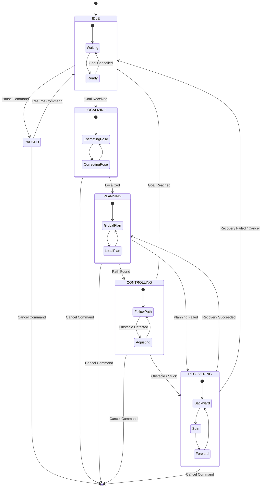

```mermaid
stateDiagram-v2
    [*] --> IDLE
    IDLE --> LOCALIZING: Goal Received
    LOCALIZING --> PLANNING: Localized
    PLANNING --> CONTROLLING: Path Found
    CONTROLLING --> IDLE: Goal Reached
    CONTROLLING --> RECOVERING: Obstacle / Stuck
    PLANNING --> RECOVERING: Planning Failed
    RECOVERING --> PLANNING: Recovery Succeeded
    RECOVERING --> IDLE: Recovery Failed / Cancel
    IDLE --> PAUSED: Pause Command
    PAUSED --> IDLE: Resume Command
    PAUSED --> [*]: Cancel Command
    LOCALIZING --> [*]: Cancel Command
    PLANNING --> [*]: Cancel Command
    CONTROLLING --> [*]: Cancel Command
    RECOVERING --> [*]: Cancel Command

    state IDLE {
        [*] --> Waiting
        Waiting --> Ready
        Ready --> Waiting: Goal Cancelled
    }
    state LOCALIZING {
        [*] --> EstimatingPose
        EstimatingPose --> CorrectingPose
        CorrectingPose --> EstimatingPose
    }
    state PLANNING {
        [*] --> GlobalPlan
        GlobalPlan --> LocalPlan
        LocalPlan --> GlobalPlan
    }
    state CONTROLLING {
        [*] --> FollowPath
        FollowPath --> Adjusting: Obstacle Detected
        Adjusting --> FollowPath
    }
    state RECOVERING {
        [*] --> Backward
        Backward --> Spin
        Spin --> Forward
        Forward --> Backward
    }
```